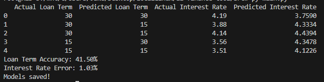

# ai-finance-tool

Sandbox to play around with AI/ML concepts and APIs in Python

## Running the program

Navigate to the `/src` directory and run `main.py` within a local python environment.

> Todo: Docker container

First the program will use the provided data (located in /resources) to train the models for interest rate and loan term predictions. Then it will prompt the user for their information and provide a personalized prediction.

> The trained models are stored in `/resources/saved-models/`.

### Example Results

A random forest regression model is used for the interest rate predictions and a random forest classier model is used for the loan term predictions.

Using sample data consiting of 1000 simulated loans, the model predicts loan term with an accuracy of 41.5% and interest rate with an error of +/- 1.03%.

## Terms

Features - Input data provided to the model  
Label/Target(s) - Output data we want to predict with the model

## ML Algorithms

- Linear regression

  - Used for predicting continuous values
  - Assumes linear relationship between input features and output labels
  - Great when data is roughly linear
  - Sucks when data isn't linear

- Random Forest
  - Builds a ton of decision trees
  - Each tree makes a prediction
  - Final result is either the average predication of all the trees (regression task) or the majority vote (classification task)
  - Great for data with complex relationships or non-linear data
