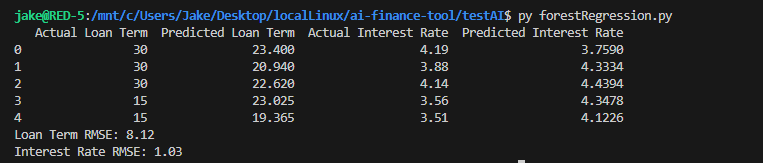

# ai-finance-tool
Sandbox to play around with AI/ML concepts and APIs in Python

## Running the program
Navigate to the `/testAI/` directory and run `python3 forestRegression.py`

> Next phase will introduce predictions for provided user inputs.

### Example Results

Using a basic forest regression model on a sample data set with 100 decision tress, the model provides interest rate and loan term predictions.

The error for loan term predictions is +/- 8 months. The error for interest rate predictions is +/- 1%.

## Terms

Features - Input data provided to the model  
Label/Target(s) - Output data we want to predict with the model

## ML Algorithms

- Linear regression
    - Used for predicting continuous values
    - Assumes linear relationship between input features and output labels
    - Great when data is roughly linear
    - Sucks when data isn't linear

- Random Forest
    - builds a ton of decision trees
    - each tree makes a prediction
    - final result is either the average predication of all the trees (regression task) or the majority vote (classification task)
    - Great for data with complex relationships or non-linear data

