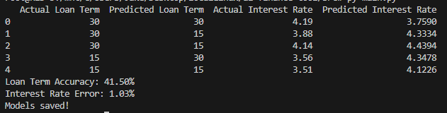

# ai-finance-tool

Sandbox to play around with AI/ML concepts and APIs in Python featuring a React frontend.

## Running the program

- Build the Docker container by navigating to the project directory and running `docker build -t fin-app .`
- Run the container in interactive mode (to be able to provide user input) with `docker run -it fin-app`

> [!NOTE]  
> You may need to run these commands with sudo.

First the program will use the provided data (located in /resources) to train the models for interest rate and loan term
predictions. Then it will prompt the user for their information and provide a personalized prediction.

> The trained models are stored in `/resources/saved-models/`.

### Example Results

A random forest regression model is used for the interest rate predictions and a random forest classier model is used
for the loan term predictions.

Using sample data consisting of 1000 simulated loans, the model predicts loan term with an accuracy of 41.5% and
interest
rate with an error of +/- 1.03%.

